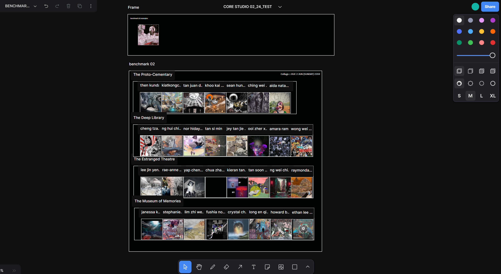
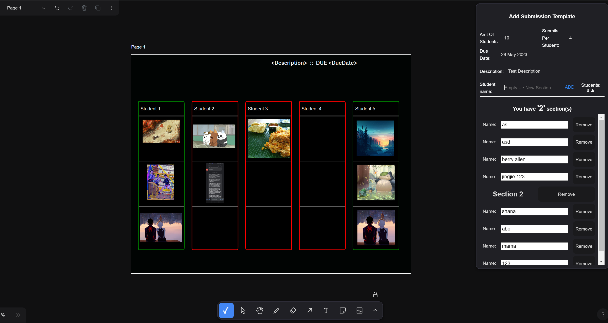

# tldraw

This fork is building upon [tldraw](https://github.com/tldraw/tldraw). tldraw is a library for creating infinite canvas experiences in React. It's the software behind the digital whiteboard [tldraw.com](https://tldraw.com).


# <span style="color: #2E86C1;">🎨 Project Submission Template Creator</span>

## <span style="color: #1ABC9C;">📘 Introduction</span>

This project utilizes REACT and Tldraw library to enable users to create customizable submission templates for others, such as students, to submit their work within designated frames. It's designed to streamline the submission process in educational settings, making it easier for instructors to collect and organize student submissions. While maintaining user's freedom of movement.

Tlextractor is utilized to extract data that the student submitted in this template. See [Tlextractor GitHub Repository](https://github.com/LamJingJie/tlextractor) for more information.

#### Before: Have to manually create each shapes and texts


#### After: Auto-Generated Template



## <span style="color: #E74C3C;">⚠️ Things to Note</span>
- <span style="color: #E74C3C;"><b>Main Frame</b></span>: Do not change the main/outermost frame name, to allow the script to accurately identify which frame to extract.


## <span style="color: #F39C12;">✨ Features</span>

With this tool, users can specify:

- <span style="color: #27AE60;"><b>Description</b></span>: A brief overview of the submission requirements.
- <span style="color: #27AE60;"><b>Due Date</b></span>: The deadline for submissions.
- <span style="color: #27AE60;"><b>Submissions Per Student</b></span>: How many submissions each student is allowed to make.
- <span style="color: #27AE60;"><b>Number of Students</b></span>: The total number of students expected to submit work.
- <span style="color: #27AE60;"><b>Names of Each Student</b></span>: Individual names for each student's submission frame.

With additional features:
- <span style="color: #27AE60;"><b>Image Snapping</b></span>: Users can throw in their img into their respective frame and it will snap dynamically.
- <span style="color: #27AE60;"><b>Color Changing</b></span>: Colour in the frames changes depending on submission status.

### <span style="color: #D35400;">🔄 Conditional Frame Creation</span>

- <span style="color: #E67E22;"><b>More Student Names than Student Amt</b></span>: If the number of names inputted exceeds the specified number of students, the application will create a frame for each name provided, ignoring the "Number of Students" setting.
- <span style="color: #E67E22;"><b>Equal Students Names and Student Amt</b></span>: If the number of names matches the number of students, a frame will be created for each student.
- <span style="color: #E67E22;"><b>Less Student Names than Student Amt</b></span>: When fewer names are provided than the number of students, frames will be created for each name. Subsequent frames without specific names will be assigned default names.

## <span style="color: #8E44AD;">🚀 Getting Started</span>

To use this project, follow these steps:

1. **Clone the repository to your local machine:**
	```bash
   	git clone <repository-url>
   	```

2. **Navigate to the project directory:**
	```bash
	cd /templates/vite/
	```

3. **Install the required dependencies:**
	```bash
	yarn
	```

4. **Run the application:**
	```bash
	yarn dev
	```

5. **Follow the on-screen instructions to create a submission template.**

## <span style="color: #2980B9;">🎥 Demo Video</span>

[](https://github.com/user-attachments/assets/8d21cb85-782c-42ee-836e-e9bb274c6ec9)
